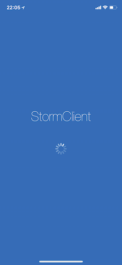
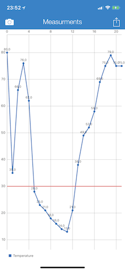
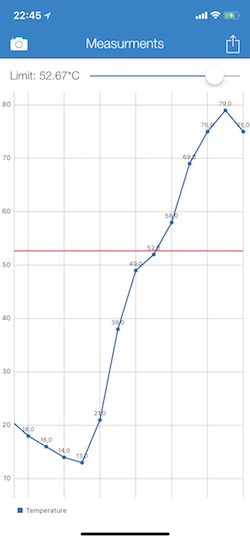
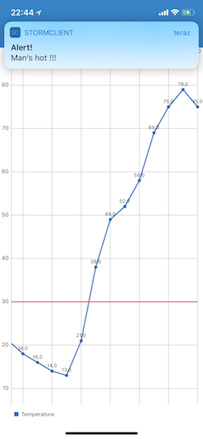
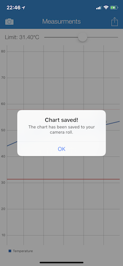

# storm-iphone-app

> Storm-iphone-app is a simple SmartStorm client for iOS based devices.

[](http://cocoapods.org/pods/LFAlertController)
[![License][license-image]][license-url]
[](https://img.shields.io/cocoapods/v/LFAlertController.svg)  


Storm-iphone-app is an iOS app for retrieving sensor data from Smart Storm online service using a REST API. The downloaded measurements are then presented on an interactive chart which offers a range of data manipulation tools.

 

## Features
- Retrieving sensor data from a remote database
- Presenting data points on an interactive chart
- Refreshing chart's content in real time
- Setting up an alert for given limits
- Saving charts to camera roll

## Requirements

- iOS 11.0+
- Xcode 9.2
- Charts library

## Installation

Copy the project's files into your local directory. Fetch all required dependencies with CocoaPods then open the project through the .xcworkspace file and build it.

## Usage example

The app fetches sensor data through a GET http request. Swap userId and sensorId for real values to present your own measurements on a chart:

```objective-c
-(void)getSensorData{
    self.loadingData = YES;
    NSString *userId = @"user-email@address.com";
    NSString *sensorId = @"sensorId-from-smartstorm";
    NSString * targetUrl = [NSString stringWithFormat:@"http://alfa.smartstorm.io/api/v1/measure?user_id=%@&sensor_id=%@&offset=%@",userId, sensorId, self.offset];
    NSMutableURLRequest *request = [[NSMutableURLRequest alloc] init];
    [request setHTTPMethod:@"GET"];
    [request setURL:[NSURL URLWithString:targetUrl]];
    
    NSURLSession * session = [NSURLSession sharedSession];
    
    [[session dataTaskWithRequest:request completionHandler:
      ^(NSData * _Nullable data,
        NSURLResponse * _Nullable response,
        NSError * _Nullable error) {
          
          self.loadingData = NO;
          if(data && !error){
              NSError* jsonError;
              NSDictionary* measurementsDict = [NSJSONSerialization JSONObjectWithData:data
                                                                   options:kNilOptions
                                                                     error:&jsonError];
              dispatch_async(dispatch_get_main_queue(), ^{
              [self updateChartWithMeasurements:measurementsDict];
              });
              
          }
          else
              NSLog(@"error:%@",error.localizedDescription);
          
      }] resume];
}
```

Tap on the arrow button the top right corner to activate a slider. With it you can change the threshold for measurements over which the alarm is to be set off.



When the limit is exceeded you get a push notification from top. The alert is presented even when the app is minimized thanks to an active background task.



Tap the camera button in the top left corner to save the current span of the chart as an image to your iPhone's camera roll.




## Meta

- Bartek Uchański 
- Jakub Kardaś 
- Distributed under the MIT License. See ``LICENSE`` for more information.

[license-image]: https://img.shields.io/badge/License-MIT-blue.svg
[license-url]: LICENSE
[codebeat-image]: https://codebeat.co/badges/c19b47ea-2f9d-45df-8458-b2d952fe9dad
[codebeat-url]: https://codebeat.co/projects/github-com-vsouza-awesomeios-com
